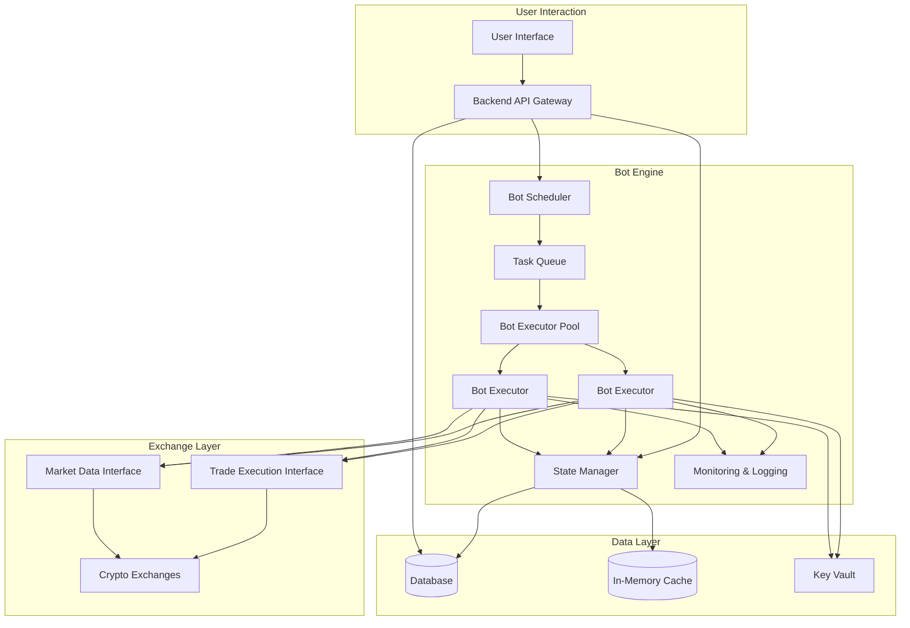

# Bot Execution Engine Architecture

---

## Overview

The Bot Execution Engine is responsible for managing, executing, and monitoring user-configured trading bots in a secure, scalable, and reliable manner. It integrates with existing backend services, exchange connectors, and the database.

---

## Core Components

- **Bot Scheduler:**  
  Manages bot start/stop times, scheduled intervals, and event triggers. Queues execution tasks.

- **Bot Executor:**  
  Runs bot strategies in isolated environments (processes or containers). Handles real-time decision logic.

- **State Manager:**  
  Persists bot state (parameters, positions, progress, error states) in the database. Provides state snapshots to executors.

- **Market Data Interface:**  
  Abstracts access to real-time and historical market data via exchange connectors.

- **Trade Execution Interface:**  
  Abstracts order placement, cancellation, and status queries via exchange connectors.

- **Monitoring & Logging Module:**  
  Tracks bot performance, logs actions, errors, and system metrics.

- **Error Handler & Recovery:**  
  Detects failures, retries operations, escalates persistent issues, and updates bot state accordingly.

---

## Execution Model

- **Hybrid Event-Driven + Scheduled:**  
  Bots can be triggered by market events (price thresholds, order fills) or run at fixed intervals (e.g., every minute). The Scheduler dispatches execution tasks accordingly.

- **Isolated Execution:**  
  Each bot runs in a separate lightweight process or container (e.g., Docker) to ensure fault isolation and security sandboxing. Use a process pool or container orchestration (e.g., Kubernetes, Nomad) for scalability.

---

## State Management

- **Persistent Storage:**  
  Use the existing database (PostgreSQL recommended) to store:

  - Bot configurations and parameters
  - Current positions and balances
  - Execution logs and error states
  - Historical performance metrics

- **In-Memory Cache:**  
  For active bots, maintain a fast-access cache (e.g., Redis) for current state to reduce DB load and latency.

- **State Sync:**  
  Executors update state after each run or on significant events. State Manager reconciles in-memory and persistent states periodically.

---

## Data Flow

- **Market Data Access:**  
  Executors request real-time data via the Market Data Interface, which fetches from exchange connectors or a centralized data cache. Historical data for backtesting is accessed similarly.

- **Trade Execution:**  
  Executors send trade instructions to the Trade Execution Interface, which routes to the appropriate exchange connector. Responses update bot state and logs.

- **User Interaction:**  
  Users configure bots via the frontend, which communicates with the backend API. Backend updates bot configs in the database and instructs the Scheduler accordingly.

---

## Scalability

- **Horizontal Scaling:**  
  Multiple instances of the Scheduler and Executor pools can run concurrently. Stateless design allows load balancing and failover.

- **Task Queue:**  
  Use a distributed task queue (e.g., RabbitMQ, Redis Queue) to manage execution jobs, enabling dynamic scaling.

- **Container Orchestration:**  
  Use Kubernetes or similar to manage isolated bot execution environments, scaling up/down based on load.

---

## Reliability

- **Retry Logic:**  
  Transient failures trigger retries with exponential backoff.

- **Circuit Breakers:**  
  Prevent cascading failures by halting bots that encounter persistent errors.

- **Monitoring & Alerts:**  
  System metrics and bot-specific logs feed into monitoring tools (e.g., Prometheus, ELK stack). Alerts notify operators of failures or anomalies.

- **Graceful Degradation:**  
  If market data is delayed or unavailable, bots pause or switch to safe mode.

---

## Security

- **API Key Handling:**  
  Executors never store raw API keys; they request temporary decrypted keys from a secure key vault service at runtime. Keys are encrypted at rest and in transit.

- **Sandboxing:**  
  Bots run in isolated processes or containers with limited permissions. Resource limits (CPU, memory) prevent abuse.

- **Input Validation:**  
  User-submitted bot configs are validated server-side to prevent injection or malicious logic.

- **Audit Logging:**  
  All bot actions and system changes are logged for auditability.

---

## Architecture Diagram

---

## Summary

This architecture ensures a modular, scalable, and secure Bot Execution Engine that integrates seamlessly with the existing Omnitrade backend, supports high concurrency, and provides robust error handling and monitoring.
