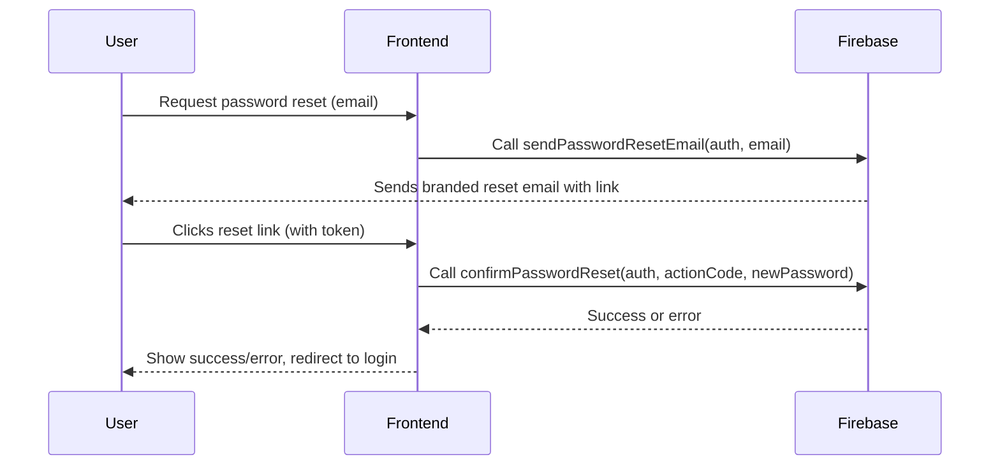

# Password Reset Enhancement Plan

---

## 1. Branding Enhancements

- **Customize Firebase Email Templates:**

  - Add project logo, colors, and friendly language.
  - Clear subject line, e.g., "Reset your OmniTrade password".
  - Instructions with support contact info.
  - Use Firebase console's email template editor.

- **Consistent UI Styling:**
  - Match reset pages (`ForgotPasswordPage`, `ResetPasswordPage`) with overall app theme.
  - Add success/error icons and animations.
  - Improve mobile responsiveness.

---

## 2. Security Improvements

- **Token Expiration:**

  - Ensure reset tokens expire within 15-60 minutes.
  - Firebase handles this, but verify settings in the Firebase console.

- **One-Time Use Tokens:**

  - Tokens should be invalid after first use (Firebase default).

- **Rate Limiting:**

  - Limit password reset requests per IP/email (e.g., 3 per hour).
  - Implement on frontend or via API gateway/middleware.

- **CAPTCHA:**

  - ~~Add CAPTCHA (e.g., Google reCAPTCHA) to the reset request form to prevent abuse.~~
  - **NOTE (2025-04-11): CAPTCHA implementation deferred. No permanent site/domain available for registration at this time. Revisit when project is deployed to a permanent domain.**

- **Audit Logging:**
  - Log reset requests and completions for security audits.
  - Store logs securely, accessible to admins only.

---

## 3. User Experience Enhancements

- **Clear Feedback:**

  - Confirm when reset email is sent (regardless of email existence, for security).
  - Show error messages for invalid/expired tokens.
  - Success message after password reset with redirect countdown.

- **Guided Instructions:**

  - Explain steps clearly on reset pages.
  - Provide link back to login or support.

- **Accessibility:**
  - Ensure forms are accessible (labels, focus states, ARIA).

---

## 4. Documentation

- Update developer docs to reflect enhanced flow.
- Add user help content on how to reset password.

---

## Enhanced Password Reset Flow Diagram

