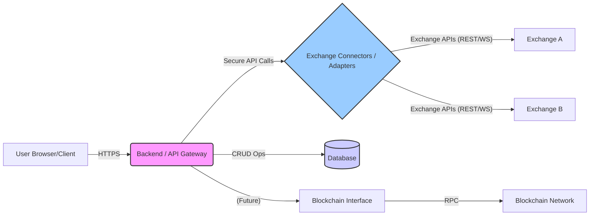

# System Architecture Overview

This document provides a high-level overview of the proposed system architecture for the OpenTrade platform.

## Goals

- Provide a responsive and real-time trading interface.
- Securely manage user data and exchange API keys.
- Connect to multiple cryptocurrency exchanges.
- Support potential future features like trading bots and blockchain interactions.
- Be maintainable and scalable.

## Components

The system is envisioned to consist of the following major components:

1.  **Frontend Application (Client-Side):**

    - **Technology:** React, TypeScript, Vite, Tailwind CSS, shadcn/ui.
    - **Responsibilities:**
      - Rendering the user interface (Dashboard, Terminal, Profile, etc.).
      - Handling user input and interactions.
      - Displaying real-time data (charts, order books) received from the Backend/API Gateway.
      - Managing local UI state.
      - Making authenticated requests to the Backend/API Gateway.
    - **Deployment:** Hosted as a static web application (e.g., on Vercel, Netlify, AWS S3/CloudFront).

2.  **Backend / API Gateway (Server-Side):**

    - **Technology:** TBD (Potential options: Node.js/Express/NestJS, Python/FastAPI, Go). Decision needed.
    - **Responsibilities:**
      - User authentication and authorization (managing sessions/tokens).
      - Securely storing and managing user profile data and encrypted exchange API keys.
      - Acting as a secure proxy between the Frontend and Exchange Connectors/APIs.
      - Aggregating data from multiple exchanges if needed.
      - Providing a unified API (REST or GraphQL - TBD) for the Frontend.
      - Handling business logic not suitable for the frontend (e.g., complex portfolio calculations, bot logic orchestration - future).
      - Potentially managing WebSocket connections for pushing real-time data to the Frontend.
    - **Deployment:** Hosted on a cloud platform (e.g., AWS EC2/ECS/Lambda, Google Cloud Run, Vercel Serverless Functions).

3.  **Database:**

    - **Technology:** TBD (Potential options: PostgreSQL, MongoDB). Decision depends on data structure needs (relational vs. document).
    - **Responsibilities:**
      - Storing user account information (hashed passwords, profile details).
      - Storing encrypted user exchange API keys.
      - Storing user settings and preferences.
      - (Future) Storing trading bot configurations, historical trade data initiated via the platform, staking information.
    - **Deployment:** Managed database service (e.g., AWS RDS, MongoDB Atlas) or self-hosted.

4.  **Exchange Connectors / Adapters (Server-Side):**

    - **Technology:** Likely integrated within the Backend/API Gateway service initially, potentially separated later. Written in the backend language.
    - **Responsibilities:**
      - Implementing the specific API protocols (REST, WebSocket) for each supported cryptocurrency exchange (e.g., Binance, KuCoin).
      - Handling authentication with exchange APIs using user-provided keys (managed by the Backend).
      - Fetching market data (prices, order books, trades).
      - Placing and managing orders.
      - Fetching account balances and positions.
      - Normalizing data formats from different exchanges where possible.

5.  **(Future) Blockchain Interface:**
    - **Technology:** TBD (e.g., Ethers.js, Web3.py).
    - **Responsibilities:**
      - Interacting with specific blockchains for features like staking, token transfers, or querying smart contracts related to rewards.
      - Likely integrated into the Backend/API Gateway.

## High-Level Interaction Flow (Example: Placing an Order)

1.  User interacts with the **Frontend** trading form.
2.  **Frontend** sends an authenticated API request to the **Backend/API Gateway** with order details.
3.  **Backend/API Gateway** validates the request, retrieves the user's encrypted API key from the **Database**, decrypts it, and identifies the target exchange.
4.  **Backend/API Gateway** forwards the request to the appropriate **Exchange Connector**.
5.  **Exchange Connector** formats the request for the specific exchange API and sends it.
6.  Exchange processes the order.
7.  **Exchange Connector** receives the response/confirmation from the exchange.
8.  **Exchange Connector** sends the result back to the **Backend/API Gateway**.
9.  **Backend/API Gateway** potentially updates the **Database** (e.g., internal order history) and sends the result back to the **Frontend**.
10. **Frontend** displays the order confirmation/status to the user.

## Diagram Placeholder

_(This Mermaid diagram provides a basic visual representation)_

---

_This architecture is preliminary and subject to refinement as requirements and technical decisions are finalized._
